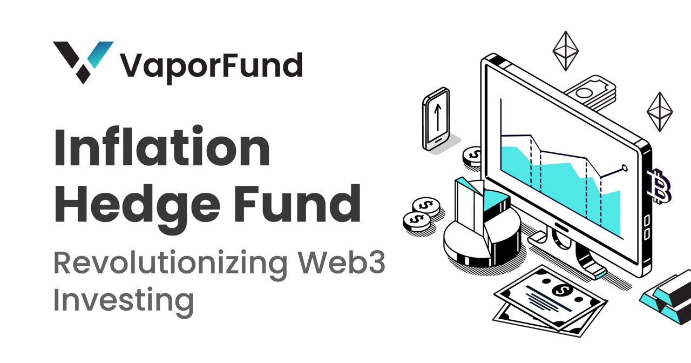

# VaporFund
VaporFund is a platform designed to extend staking accessibility, offering multiple methods such as Restaking, Real World Assets (RWA), and traditional staking. Our platform helps diversify investment portfolios, providing a simple, safe, and multi-reward investment approach.

## Solutions Implemented

### Restaking
- Restaking involves bridging across chains and reinvesting rewards to increase asset supply over time. User assets on child chains are secured by the parent chain, ensuring safety and reliability.

### Real World Assets (RWA)
We offer two options for RWA:
1. **Option One**: User assets are redirected to three partners simultaneously, allowing users to earn rewards during the investment period.
2. **Option Two**: Daily assets are held in a vault and redirected at the end of the day, minimizing fees with our campaign.

### Staking
- We stake tokens on the platform to earn rewards, providing users with additional incentives.

## Key Features
- **Multi-Method Support**: Restaking, Real World Assets, and traditional staking.
- **Investment Diversity**: Helps diversify your investment portfolio.
- **Simple and Safe**: User-friendly interface with a focus on security.
- **Multi-Reward System**: Earn rewards from various investment methods.

## How to Use
- **Restaking**: Bridge your assets across chains and reinvest rewards automatically.
- **Real World Assets (RWA)**: Choose between simultaneous redirection to partners or holding assets in a vault for minimized fees.
- **Staking**: Stake your tokens on the platform to earn rewards.

## Conclusion
VaporFund opens new avenues for investment, combining simplicity, safety, and multiple reward opportunities.

## Referral Websites
- Visit our website: [VaporFund](https://vaporfund.com/)
- Visit our documentation website [VaporFund Docs](https://docs.vaporfund.com/)
