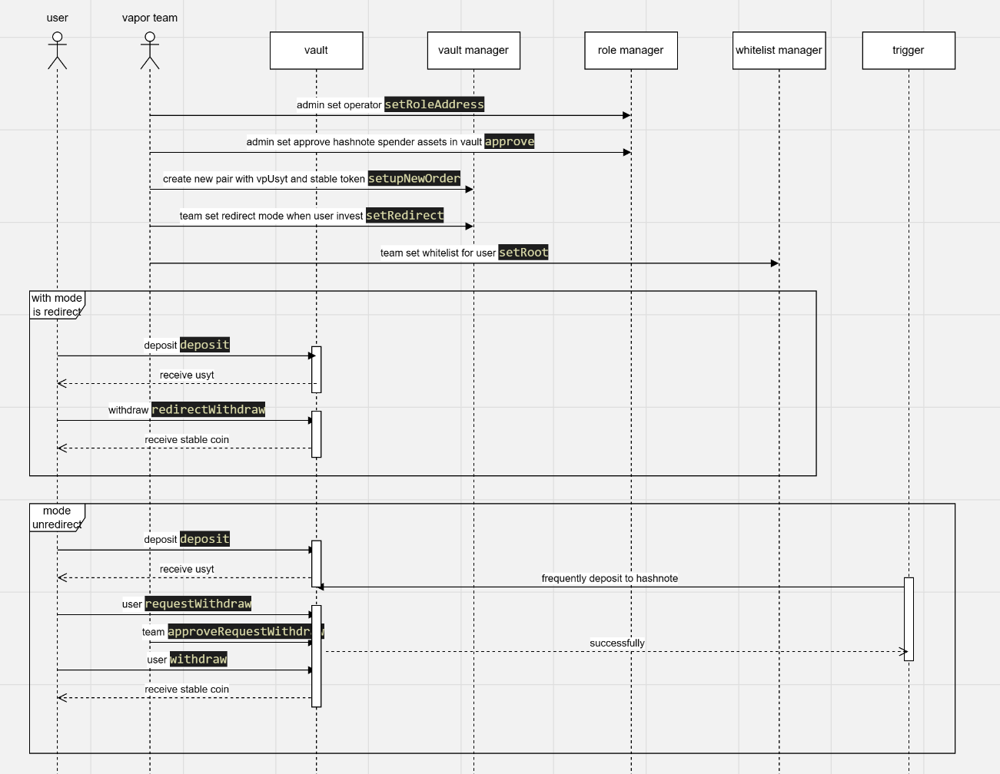

# VaporFund Smart Contracts

This repository contains the smart contracts for VaporFund, a platform designed to extend staking accessibility through methods such as Real World Assets (RWA), Restaking, and traditional staking. 

## Architecture
By implementing all contracts in one repository, we ensure consistent configuration, ease of maintenance, and streamlined development.

### 1. Real World Assets (RWA)
- Flow for Setup and Invest
    - `For the mode 'unredirect', the worker implementation will be added later, but manual redirect are possible.`



- Role Manage Details
    - **`Recommend using a multisig wallet such as Safe Wallet, Design Wallet, or MPCVault Wallet for vault management.`**
    - To configure roles, go to the role manage contract.
    - **Owner**
        - Can set addresses for the Super Admin and other roles.
        - Should use a multisig wallet for security.
    - **Supper admin**
        - Can set roles and addresses for those roles.
        - Should use a multisig wallet for security.
        - Can set vault managers and whitelist managers for significant upgrades to the vault contract.
        - Has exclusive permission to call the `approve` function in the vault contract.
        - If using a multisig wallet, the Owner and Super Admin can be the same address.
    - **VAULT_RWA_CALLER_ROLE**
        - ***Role byte32:*** `0xcad85a693c97aea9a159eddfc215e76c511f55b9d317a82b23c4141b078c64c7`
        - Allows external contracts to call logic in the vault contract. This is potentially dangerous if the  external contracts are not secure.
        - Should be used for triggering automated deposits or withdrawals.
    - **VAULT_RWA_OPERATOR_ROLE**
        - ***Role byte32:*** `0x68d58977296b53c00176808dba3062fd920d6fba9d34daab485b3a31b2afedbb`
        - Can approve withdrawal requests in the vault contract.
        - Can set up, enable, and disable new orders.
        - Can set minimum deposit amounts.
        - Can set delay fees for deposits.
        - Can configure redirection modes for deposits or withdrawals.
        - Can create new tokens in the vault management contract.
    - **VAULT_RWA_SPENDER_APPROVE_ROLE**
        - ***Role byte32:*** `0x0e6e592b6b5bc62e7d850078c0c85c87d354122e248b1884918dacf86c7996da`
        - This is a highly sensitive role, allowing another contract to use assets in the contract.
        - Intended for third-party use or emergency situations to withdraw assets externally.
    - **TRIGGER_CALLER_ROLE**
        - ***Role byte32:*** `0x28fd5ea3f168a16e1dc653b4f708cde55b68b4990604c0be4dd11376bf3de13d`
        - Allows any wallet to call triggers.
        - Intended for workers or manual redirection tasks.


### 2. Restaking
- Contracts for bridging across chains, reinvesting rewards, and securing user assets across child and parent chains.

### 3. Staking
- Contracts for staking tokens on the platform to earn rewards.

## Repository Structure

```plaintext
contract/
    ├── interfaces/
    │   ├── IVault.sol
    │   └── ...
    ├── libs/
    │   ├── Hashnote.sol
    │   ├── EtherFi.sol
    │   └── ...
    ├── rwa/
    │   └── ...
    ├── restaking/
    │   └── ...
    ├── staking/
    │   └── ...
test/
    ├── rwa/
    │   ├── hashnoteHelper.js
    │   └── ...
    ├── restaking/
    │   ├── restaking.js
    │   └── ...
    ├── staking/
    │   ├── staking.js
    │   └── ...
    └── ...
```

## Implement Smart Contracts
### Real World Asset (RWA) `(deployment for ethereum)`
- **Vault:** 0xdc9C2e95811b183752A1c5893182904d4fa7E781
- **Vault Manage:** 0xc0796534790e3b6880B62CC9a15FFAff27ad2272
- **Role Manage:** 0xA62C5631A7e6F88d0E1F60ca6fdfE8DF2aD249c8
- **Whitelist Manage:** 0x97E94C785F94DE64e66745811F1bb7b0193f5f80
- **Hashnote Helper:** 0xB70cE4DeaA377eAd7cA4aCCd2eBd5B6319057F3B
- **Hashnote Trigger:** 0x7BDd685DE818e8Ddd8B1fd91BC3Ac219112B16e7
- **USYT:** 0x0e0cD306EC48CC61CA582a80c63806058920961C
- **NFT Withdraw:** 0x325F98EA2DBDe2E8045663407Af902b9A24d9193
### Restaking `(deployment for bsc smart chain)`
- **Vault:** 0x6bD3F345Da171a2c21e567Fd4C402FE9C26596b4
- **Vault Manage:** 0x33a3AF5b6CD03191Dac6711217f7Da26bAed96D6
- **Whitelist Manage:** 0x4A8323C88d11c3e0c05A23810B5881B6c4b024b3
- **Controller:** 0xA399C8215c7Ea8104bf3e1182762a772F46B8F80
- **VpEEth:** 0x5fd8702C86543F9d894BA4C044390E8e9411DF4D
- **NFT Withdraw:** 0x443827D7Bb4b6c8A49cEaC9efB69c233d52893af
